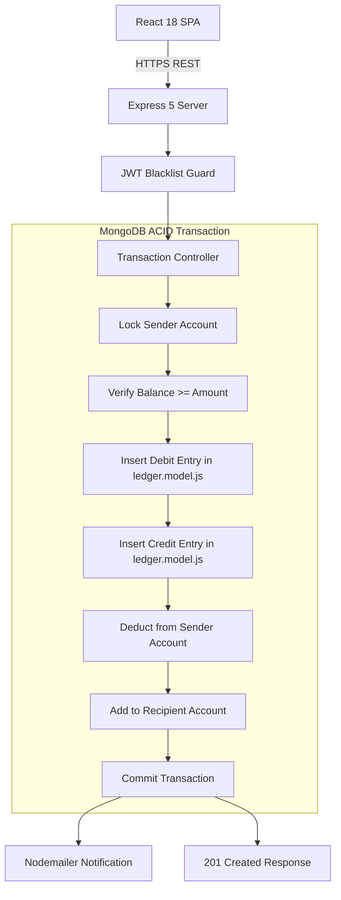

# Architecture & Ledger System Design

## Core Ledger Flow

```mermaid
graph TD
    Client[React 18 SPA] -->|HTTPS REST| Gateway[Express 5 Server]
    Gateway --> AuthGuard[JWT Blacklist Guard]
    AuthGuard --> TxCtrl[Transaction Controller]
    
    subgraph "MongoDB ACID Transaction"
        TxCtrl --> Lock[Lock Sender Account]
        Lock --> Verify[Verify Balance >= Amount]
        Verify --> Debit[Insert Debit Entry in ledger.model.js]
        Debit --> Credit[Insert Credit Entry in ledger.model.js]
        Credit --> UpdateFrom[Deduct from Sender Account]
        UpdateFrom --> UpdateTo[Add to Recipient Account]
        UpdateTo --> Commit[Commit Transaction]
    end

    Commit --> Mailer[Nodemailer Notification]
    Commit --> Res[201 Created Response]
```
